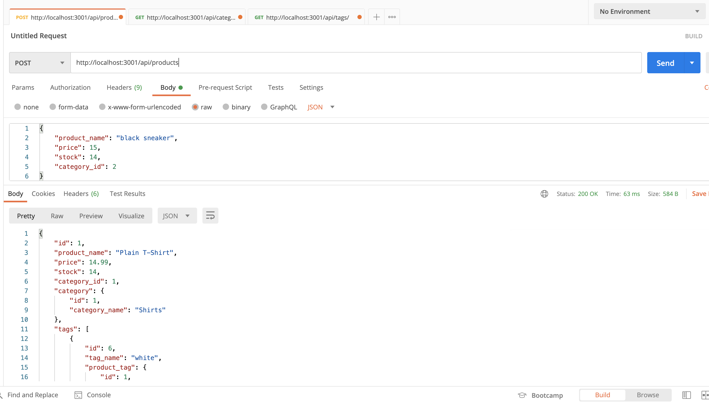
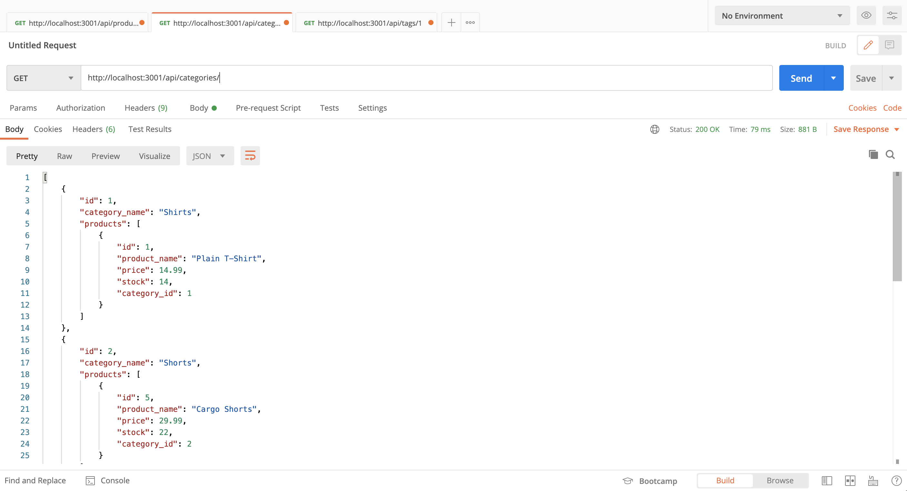
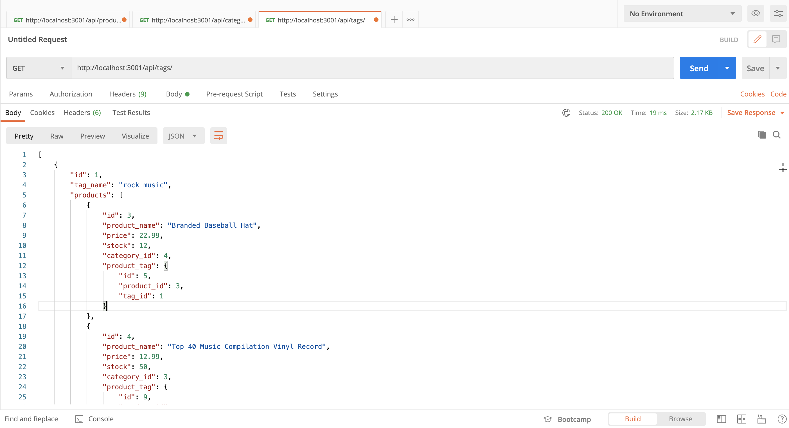
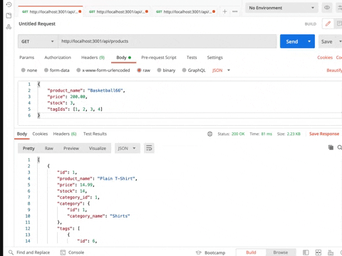
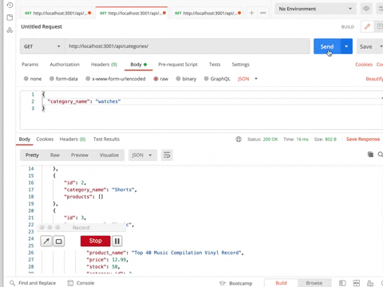
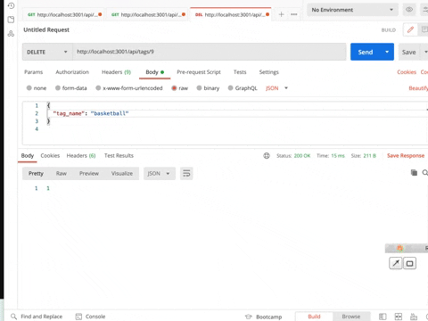

# E-commerce-BackEnd-ORM

### Build the back end for an e-commerce site. Take a working Express.js API and configure it to use Sequelize to interact with a MySQL database.

### GET, POST, PUT, and DELETE

- Product GET


- Category GET


- Tag GET



- Product's CRUD



- Category's CRUD



- Tag's CRUD



### Database Models

- `Category`

  - `id`

    - Integer
    - Doesn't allow null values
    - Set as primary key
    - Uses auto increment

  - `category_name`
    - String
    - Doesn't allow null values

- `Product`

  - `id`

    - Integer
    - Doesn't allow null values
    - Set as primary key
    - Uses auto increment

  - `product_name`

    - String
    - Doesn't allow null values

  - `price`

    - Decimal
    - Doesn't allow null values
    - Validates that the value is a decimal

  - `stock`

    - Integer
    - Doesn't allow null values
    - Set a default value of 10
    - Validates that the value is numeric

  - `category_id`
    - Integer
    - References the category model's id

- `Tag`

  - `id`

    - Integer
    - Doesn't allow null values
    - Set as primary key
    - Uses auto increment

  - `tag_name`
    - String

- `ProductTag`

  - `id`

    - Integer
    - Doesn't allow null values
    - Set as primary key
    - Uses auto increment

  - `product_id`

    - Integer
    - References the product model's id

  - `tag_id`
    - Integer
    - References the tag model's id

### Instructions on how to run the app

- Add a .env file to the root of the app with the following details

```text
DB_NAME='ecommerce_db'
DB_USER='root'
DB_PW='xxx'
```

- Create schema: run "mysql -u root -p" and "source db/schema.sql"
- Create seed data: run "npm run seed"
- Start the app with "npm start"
- GET routes to return all categories, products and tags

### Demo Video

https://www.youtube.com/watch?v=Us0eyYtW3QQ&ab_channel=rongbangye
